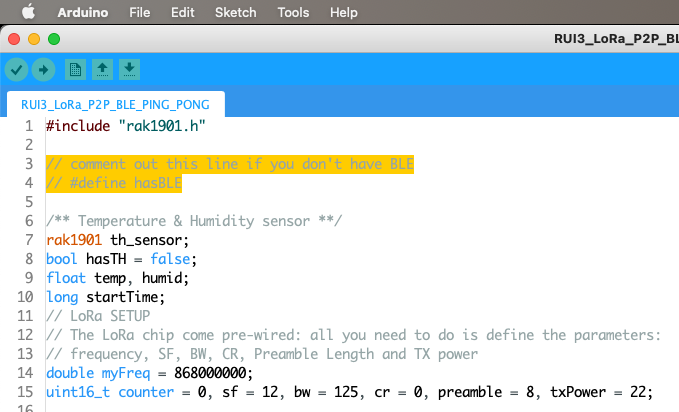
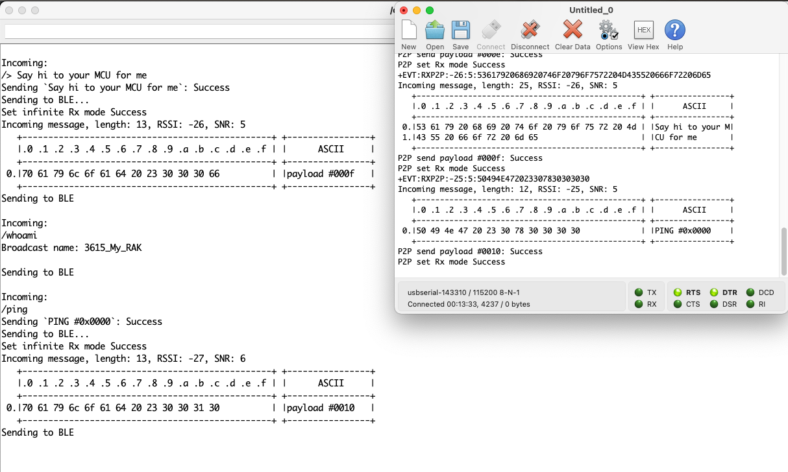
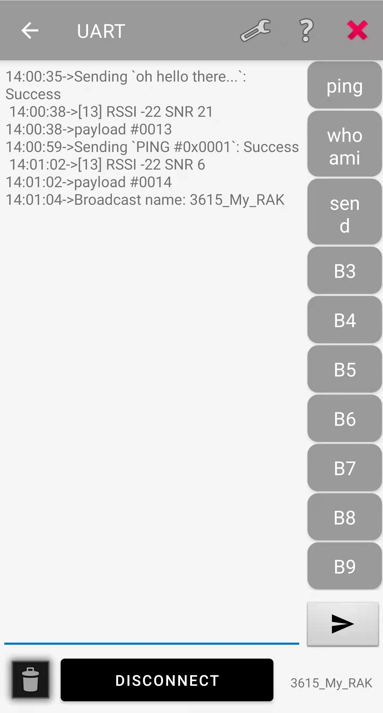
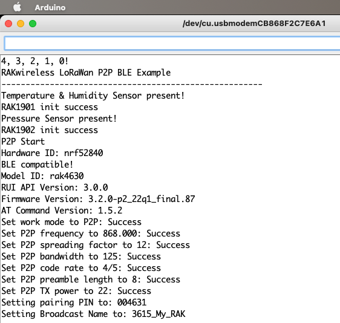
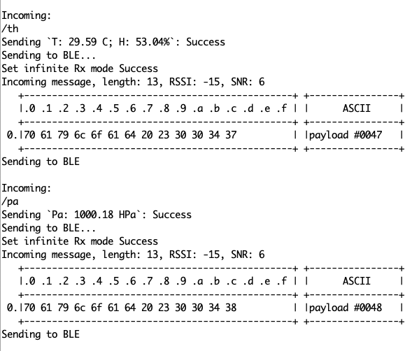

# RUI3_LoRa_Kitchen_Sink

A BLE-enabled[*] PING-PONG LoRa P2P sketch for RUI3 / RAK4631 and RAK3172 with lots of options, based on [RUI3_LoRa_P2P_BLE_PING_PONG](https://github.com/Kongduino/RUI3_LoRa_P2P_BLE_PING_PONG).

_[*] if available_

### RAK4632 & RAK3172

The code works uniformly on both platforms, as is. You only need to compile the firmware and upload it. This can be all done in Arduino IDE, but there's a caveat for RAK3172: it needs to be set in `BOOT_MODE`. This is done by connecting the `TX1` pin on the baseboard to the `VDD` pin and resetting the board. Once this is done you can sever the connection. On RAK4631 there's no need for this (although the upload process is a little slower, as the reset to boot mode is done in software).



It accepts so far thirteen commands, via Serial and/or BLE:

* `/i2c`: runs an I2C scan to see what's on the bus. Displays on the Serial monitor and OLED if available.
* `/whomai`: get the BLE broadcast name. Useful when you have a few devices. You enter this command on Serial, and get the right name.
* `/ping`: self-explanatory I believe...
* `/> xxxxx`: send a custom message. Notice the space between `/>` and `xxxxxx`.
* `/th`: send the temperature and humidity if you have a [RAK1901](https://store.rakwireless.com/products/rak1901-shtc3-temperature-humidity-sensor) connected.
* `/pa`: send the air pressure if you have a [RAK1902](https://store.rakwireless.com/products/rak1902-kps22hb-barometric-pressure-sensor) connected.
* `/htu`: send the temperature and humidity if you have an [HTU21D](https://www.mikroe.com/htu21d-click), or similar, connected.
* `/lux`: send the Ambient Light level if you have a [RAK1903](https://store.rakwireless.com/products/rak1903-opt3001dnpr-ambient-light-sensor) connected.
* `/bme`: send the temperature, humidity and air pressure if you have a [RAK1906](https://store.rakwireless.com/products/rak1906-bme680-environment-sensor) connected.
⁉️ HPa data seems off by quite a bit, at least on my rak1906...
* `/msl xyzt`: sets the MSL to a new value. Useful for the next command.
* `/alt`: calculates the altitude from the current pressure and MSL. If both 1902 and 1906 are present, it will do it twice.
* `/set yyyy-mm-dd hh:mn:ss` sets the date and time if you have a DS3231M RTC.
* `/rtc` displays the date and time if you have a DS3231M RTC.

Yes, the sketch recognizes the sensors on its own.

### OLED

I added recognition of an OLED display, and implemented display of relevant information with very smooth scrolling, thanks to the [ss_oled library](https://github.com/bitbank2/ss_oled). You however need to patch the ss_oled.h header file: currently RUI3 is missing stuff from pgmspace.

Right under

`#include <BitBang_I2C.h>`

add

```c
#ifdef __RUI_TOP_H__
#include "/Users/YOURID/Library/Arduino15/packages/rakwireless/hardware/nrf52/1.0.1/cores/nRF5/avr/pgmspace.h"
#endif
```

Where `YOURID` is your login ID on Mac. This requires a little adjustment for Windows and Linux – basically point at the right location under `Arduino15`. This uses the macro definitions from the [RAK Arduino BSP](https://github.com/RAKWireless/RAK-nRF52-Arduino) (which means you need that too...). And this fixes the issues.

### DS3231M

Same procedure for the RTC: in [`DS3231M.h`](https://github.com/Zanduino/DS3231M) below `#include "Arduino.h"` add the same patch as for `ss_oled.h`. In a coming release, the RTC will be used to timestamp packets.






