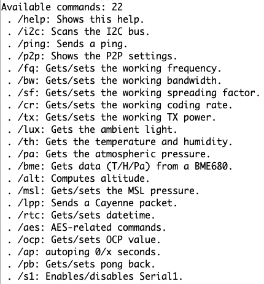

# RUI3_LoRa_Kitchen_Sink

A BLE-enabled[*] PING-PONG LoRa P2P sketch for RUI3 / RAK4631 and RAK3172 with lots of options, based on [RUI3_LoRa_P2P_BLE_PING_PONG](https://github.com/Kongduino/RUI3_LoRa_P2P_BLE_PING_PONG).

_[*] if available_

### RAK4631 & RAK3172

The code works uniformly on both platforms, as is. You only need to compile the firmware and upload it. This can be all done in Arduino IDE, but there's a caveat for RAK3172: it needs to be set in `BOOT_MODE`. This is done by connecting the `TX1` pin on the baseboard to the `GND` pin and resetting the board. Once this is done you can sever the connection. On RAK4631 there's no need for this (although the upload process is a little slower, as the reset to boot mode is done in software).

### Saving firmwares for later reuse.

```bash
python3 ~/Library/Arduino15/packages/rak_rui/tools/uploader_ymodem/1.0.0/uploader_ymodem.py \
-f /var/folders/fg/nc6_xxxx/T/arduino_build_668203/RUI3_LoRa_Kitchen_Sink.ino.bin \
-p /dev/cu.usbserial-XXXXXX 
```

The command to upload the firmware looks like this. The path to the Arduino temp folder and the USB port will differ, but at least on Mac OS X that's pretty close. You can `open` in the Terminal that temp folder (or `cd` to it) and save the `.zip` file for RAK4631, and `.bin` file for RAK3172. I tend to add then the MCU's name to the file. With that file saved somewhere safe, you can reflash the firmware without having to recompile it. Useful, among other things, if you want to flash several boards, or switch between different firmwares.


## COMMANDS
It accepts so far 24 commands, via Serial (USB Serial and Serial1, the latter can be disabled and enabled on the fly) and/or BLE. The command system has been rewritten from scratch, and is now easily extendable. An array of a struct called `myCommand`, which holds the name of the command, a help message, and a pointer to a function, is created on the fly at boot time. User input is compared to the list of available commands. Use the `/help` command to see all available commands.

<br />
Incoming command from the BQ10 keyboard – for the moment blind: you have to look at the Serial monitor, or trust your Blackberry typing skills! :-)

```c
struct myCommand {
  void (*ptr)(char *); // Function pointer
  char name[12];
  char help[48];
};

myCommand cmds[] = {
  {handleHelp, "help", "Shows this help."},
  {i2cScan, "i2c", "Scans the I2C bus."},
#ifdef __RAKBLE_H__
  {whoami, "whoami", "Gets the BLE broadcast name."},
#endif
  {sendPing, "ping", "Sends a ping."},
  {handleP2P, "p2p", "Shows the P2P settings."},
  {handleFreq, "fq", "Gets/sets the working frequency."},
  {handleBW, "bw", "Gets/sets the working bandwidth."},
  {handleSF, "sf", "Gets/sets the working spreading factor."},
  {handleCR, "cr", "Gets/sets the working coding rate."},
  {handleTX, "tx", "Gets/sets the working TX power."},
  {handleLux, "lux", "Gets the ambient light."},
  {handleTH, "th", "Gets the temperature and humidity."},
  {handlePA, "pa", "Gets the atmospheric pressure."},
  {handleBME, "bme", "Gets data (T/H/Pa) from a BME680."},
  {handleALT, "alt", "Computes altitude."},
  {handleMSL, "msl", "Gets/sets the MSL pressure."},
  {sendLPP, "lpp", "Sends a Cayenne packet."},
  {handleRTC, "rtc", "Gets/sets datetime."},
  {handleAES, "aes", "AES-related commands."},
  {handleOCP, "ocp", "Gets/sets OCP value."},
  {handleAutoPing, "ap", "autoping 0/x seconds."},
  {handlePongBack, "pb", "Gets/sets pong back."},
  {handleSerial1, "s1", "Enables/disables Serial1."},
};
```


*The help menu*

### System
* `/help`: Displays the list of available commands.
* `/i2c`: runs an I2C scan to see what's on the bus. Displays on the Serial monitor and OLED if available.
* `/whomai`: gets the BLE broadcast name. Useful when you have a few devices. You enter this command on Serial, and get the right name.
* `/s1`: `/s1` or `/s1?` displays the current Seria1l status, whereas `/s1 0..1` sets it, `0` = off, `1` = on.
* `/oled`: `/oled` or `/oled?` gets OLED on/off status, whereas `/oled 1` or `oled on` turns it on, and `/oled 0` or `oled off` turns it off.

### Environment
* `/th`: sends the temperature and humidity if you have either a [RAK1901](https://store.rakwireless.com/products/rak1901-shtc3-temperature-humidity-sensor), an [HTU21D](https://www.mikroe.com/htu21d-click), or similar, or a [RAK1906](https://store.rakwireless.com/products/rak1906-bme680-environment-sensor), or similar bme680 sensor, connected.
* `/pa`: sends the air pressure if you have a [RAK1902](https://store.rakwireless.com/products/rak1902-kps22hb-barometric-pressure-sensor) connected.
* `/bme`: sends the temperature, humidity and air pressure if you have a [RAK1906](https://store.rakwireless.com/products/rak1906-bme680-environment-sensor) or a BME280 module connected. Since these 2 modules often have the same `0x76` i2c address, the startup code checks the ID number (`0x60` for bme280, `0x61` for bme680) and adjusts the variables according to the result.
* `/msl xyzt`: sets the MSL to a new value. Useful for the next command.
* `/alt`: calculates the altitude from the current pressure and MSL. If both 1902 and 1906 are present, it will do it twice.
* `/lux`: sends the Ambient Light level if you have a [RAK1903](https://store.rakwireless.com/products/rak1903-opt3001dnpr-ambient-light-sensor) (or a similar OPT3001 sensor), or a BH1750 (using [this library](https://github.com/claws/BH1750)) connected.

### RTC
* `/rtc [yyyy-mm-dd hh:mn:ss]` displays and sets the date and time if you have a DS3231M (using the [DS3231M library](https://github.com/Zanduino/DS3231M)), or a [RAK12002](https://store.rakwireless.com/products/rtc-module-rak12002) RTC module, using the [Melopero_RV3028 library](https://github.com/melopero/Melopero_RV-3028_Arduino_Library).

### LoRa P2P
* `/ping`: self-explanatory I believe...
* `/send xxxxx`: Sends a custom message.
* `/lpp`: Send all available data points as a Cayenne LPP packet. If you have an RTC connected, the first channel wil be UNIX time.


(Yes there is a problem with Unix Time, hush.)

(* `/> xxxxx`: sends a custom message. Notice the space between `/>` and `xxxxxx`.) <-- to be reimplemented

* `/p2p`: displays the main P2P settings.
* `/sf`: `/sf` or `/sf?` displays the current spreading factor used, whereas `/sf 5..12` sets it.
* `/bw`: `/bw` or `/bw?` displays the current bandwidth used, in KHz, whereas `/bw 0..9` sets it.
**Note:** There's a bug presently in the API, whereas BW values below 7, ie 125 KHz, are not recognized. Temporary fix until the engineers enables all 10 values, values between 0 and 7 are set to 125 KHz. Normal values are, 0 to 9: 7.810, 10.420, 15.630, 20.830, 31.250, 41.67, 62.50, 125, 250, 500.
* `/cr`: `/cr` or `/cr?` displays the current coding rate used, whereas `/cr 5..8` sets it.
* `/tx`: `/tx` or `/tx?` displays the current TX power used, whereas `/cr 5..22` sets it.
* `/fq`: `/fq` or `/fq?` displays the current frequency used, whereas `/fq 150.0 ,, 960..` sets it. Note that RAK4631 and RAK3172 come in -H and -L versions, so not all frequencies will actually work.
* `/ocp`: `/ocp` or `/ocp?` displays the current Over-Current Protection value, whereas `/ocp 60..140` sets it.
* `/ap`: `/ap` or `/ap?` displays the current autoping status, whereas `/ap 0..n` sets it, `0` = off, `n` = minutes.
* `/pb`: `/pb` or `/pb?` displays the current pong back status, whereas `/pb 0..1` sets it, `0` = off, `1` = on.


**Yes, the sketch recognizes the sensors on its own.**

### OLED

I added recognition of an OLED display, and implemented display of relevant information with very smooth scrolling, thanks to the [ss_oled library](https://github.com/bitbank2/ss_oled). You however need to patch the `ss_oled.h` header file: currently RUI3 is missing stuff from pgmspace.

Right under

`#include <BitBang_I2C.h>`

add

```c
#ifdef __RUI_TOP_H__
#include "/Users/YOURID/Library/Arduino15/packages/rakwireless/hardware/nrf52/1.0.1/cores/nRF5/avr/pgmspace.h"
#endif
```

Where `YOURID` is your login ID on Mac. This requires a little adjustment for Windows and Linux – basically point at the right location under `Arduino15`. This uses the macro definitions from the [RAK Arduino BSP](https://github.com/RAKWireless/RAK-nRF52-Arduino) (which means you need that too...). And this fixes the issues.

### DS3231M

Same procedure for the RTC: in [`DS3231M.h`](https://github.com/Zanduino/DS3231M) below `#include "Arduino.h"` add the same patch as for `ss_oled.h`. In a coming release, the RTC will be used to timestamp packets.


